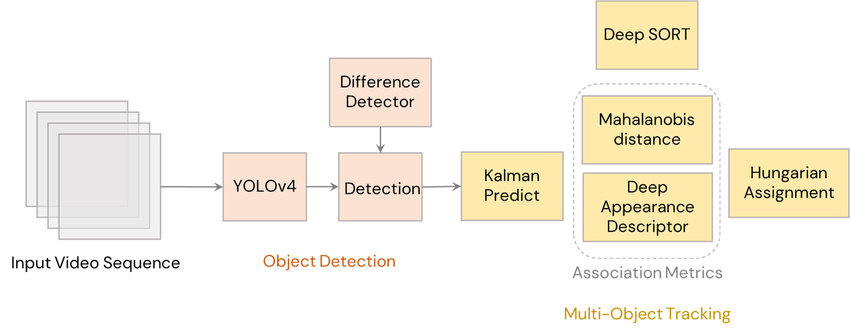

# Трекер действительного рабочего времени единиц строительной техники

Алгоритм ведет подсчет суммарного количества времени нахождения единицы строительного оборудования в состоянии использования по назначению.
 

Задача решена при помощи методов компьютерного зрения.
 

В основе алгоритма лежит пайплайн, схема которого представлена на рисунке ниже
  

Пайплайн состоит из модулей обнаружения и слежения.
 

В качестве детектора использована real-time нейросеть YOLOv3 (папка pictor-ppe), предобученная на датасете https://drive.google.com/drive/folders/1cZHC_qz4qphXJT5dJTvkgvAgttoPp_Jd.

Ссылка на веса модели детектора: https://disk.yandex.ru/d/Nrvs-mqSKA81vg
 

В качестве модуля трекинга используется алгоритм deepsort (папка deep-sort) (deep simple online realtime tracking): https://pypi.org/project/deep-sort-realtime/
 

Модель собрана с помощью python-библиотеки глубокого обучения tensorflow>=2.0

Процесс обработки видео в коде можно посмотреть в ноутбуке Construction_Machinery_tracking.ipynb 

